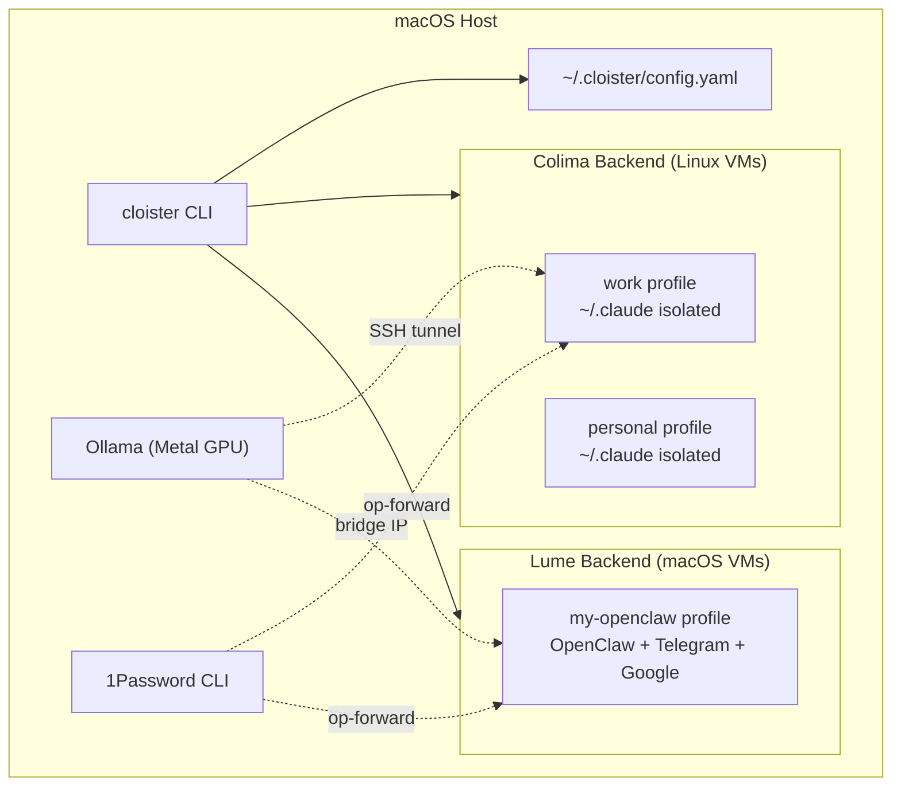
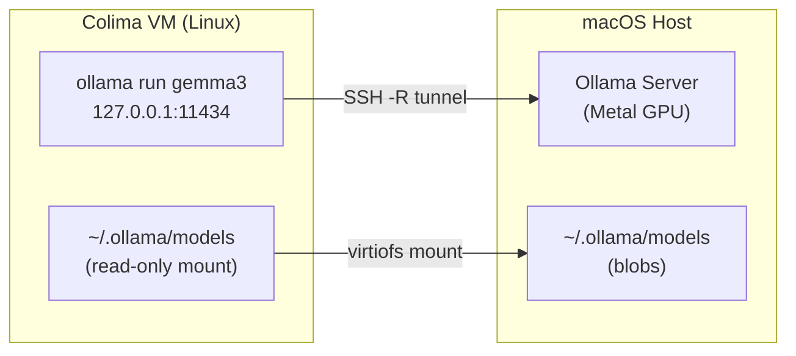
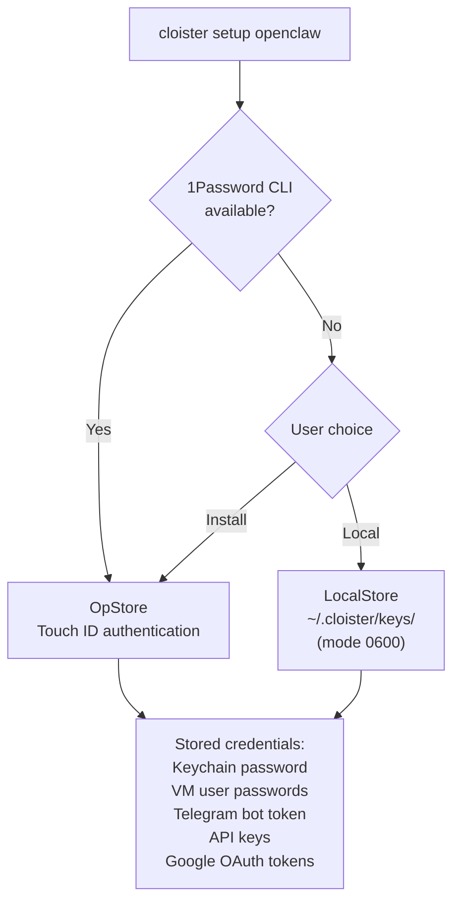
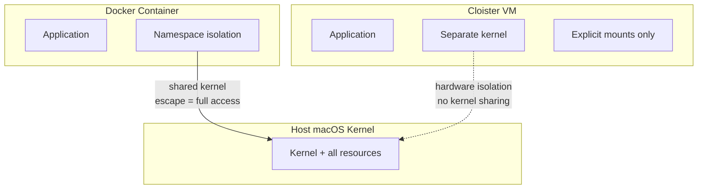

# Cloister: Isolated VMs for AI Agents & Multi-Account Claude Code on macOS

[](https://github.com/ekovshilovsky/cloister/actions/workflows/ci.yml)
[](https://github.com/ekovshilovsky/cloister/releases/latest)
[](https://goreportcard.com/report/github.com/ekovshilovsky/cloister)
[](LICENSE)

Isolated macOS VM environments for running multiple Claude Code organizations, sandboxing autonomous AI agents like [OpenClaw](https://openclaw.ai/), and separating credentials across client engagements.


## Why cloister?

**Multi-account isolation.** Claude Code stores credentials, conversation history, and project config in `~/.claude`. If you work across multiple organizations, every session shares the same identity. cloister gives each account its own isolated VM with separate credentials, CLAUDE.md, and conversation history.

**Autonomous agent containment.** AI agents like OpenClaw run 24/7 with shell access, browser control, and cron scheduling. cloister's VM isolation is stronger than Docker (separate kernel, not just namespace isolation) — services inside the VM are unreachable from the host unless explicitly tunneled, and `cloister stop` is an instant kill switch.

**Dual-backend architecture.** Colima (Linux VMs) for Claude Code isolation and Docker workloads. Lume (macOS VMs via Apple Virtualization Framework) for OpenClaw and agents needing macOS-native features like iMessage via BlueBubbles.

## Architecture



## Quick Start

```bash
# Install
brew install ekovshilovsky/tap/cloister

# Create a Claude Code profile (Colima/Linux)
cloister create work
cloister work
# You're in an isolated VM. Run: claude login

# Create an OpenClaw profile (Lume/macOS)
cloister create --openclaw my-oc
cloister setup openclaw my-oc
# Guided wizard configures Telegram, Ollama, Google OAuth, device pairing
```

## Commands

```
cloister create <profile>          Create a new isolated profile
cloister <profile>                 Enter a profile (starts VM if needed)
cloister stop [profile|all]        Stop environment(s) to free memory
cloister status                    Show all profiles with backend, state, memory
cloister logs <profile>            View logs (gateway logs for Lume, Docker for Colima)
cloister delete <profile>          Destroy a profile and its data
cloister update [profile|all]      Update Claude Code and system packages
cloister backup [profile|all]      Back up session data (history, settings)
cloister restore <profile>         Restore from backup
cloister rebuild <profile>         Backup, destroy, re-provision, restore
cloister repair [profile|--base]   Fix missing configuration without rebuilding
cloister setup <service>           Guided install for optional services
cloister setup openclaw [profile]  Guided OpenClaw setup wizard
cloister add-stack <profile> <s>   Add toolchain to an existing profile
cloister update-config <profile>   Toggle settings (e.g. --claude-local)
cloister exec <profile> <cmd>      Run a command inside a VM
cloister config                    Edit configuration
cloister self-update               Update cloister itself
cloister --version                 Print version
```

## Backends

cloister automatically selects the right VM backend based on the workload:

| Backend | VM Type | Use Case | Created With |
|---------|---------|----------|--------------|
| **Colima** | Linux | Claude Code isolation, Docker workloads, multi-account separation | `cloister create <name>` |
| **Lume** | macOS | OpenClaw agents, macOS-native features (iMessage, native apps) | `cloister create --openclaw <name>` |

The CLI surface is identical for both backends — `status`, `stop`, `logs`, `exec` all work the same way.

## OpenClaw Setup Wizard

`cloister setup openclaw` is a guided wizard that takes an OpenClaw Lume VM from freshly created to fully configured:

```bash
cloister create --openclaw my-oc    # Create the Lume VM
cloister setup openclaw my-oc       # Run the wizard
```

The wizard configures five sections in order:

| Section | What it does |
|---------|-------------|
| **Credentials** | Detects 1Password CLI (or local fallback), generates keychain password, stores VM user credentials |
| **Channels** | Telegram bot setup via BotFather, WhatsApp linked device pairing (action-only) |
| **Providers** | Ollama auto-detection on bridge IP, Anthropic API key, default provider selection |
| **Google OAuth** | SSH tunnel for OAuth callback, Google service authorization (Gmail, Calendar, Drive, Contacts, Docs, Sheets) |
| **Device Pairing** | Node host registration, trusted proxies, device approval, gateway health probe |

On first run the wizard walks through each section linearly. On subsequent runs it shows a menu of configured vs unconfigured sections for reconfiguration.

### Non-interactive mode

```bash
# Full non-interactive setup
cloister setup openclaw my-oc \
  --telegram-token="BOT_TOKEN" \
  --telegram-user-id="USER_ID" \
  --default-provider=ollama \
  --ollama-model=qwen3:32b \
  --google-client-secret=~/client_secret.json \
  --google-email="user@gmail.com"

# Discovery for AI agents
cloister setup openclaw my-oc --list-options --json
```

### Write-early design

Every credential and config value is written immediately when collected — never batched at the end. If the wizard is interrupted, re-running it resumes from the last completed step.

## Profile Status

```
$ cloister status

PROFILE       BACKEND  STATE    MEMORY  IDLE   HOST                        STACKS
battery-1800  colima   running  4GB     never  localhost (ssh tunnel)      dotnet
my-openclaw   lume     running  8GB     never  cloister-my-openclaw.local  web
work          colima   running  4GB     20h    localhost (ssh tunnel)      web,dotnet,cloud

Budget: 16GB / 22GB used
```

Colima profiles are reachable via SSH tunnel on localhost. Lume profiles advertise mDNS hostnames on the local network.

## Profile Creation

### Interactive (default)

```
$ cloister create work

Creating profile "work"...
Use defaults? (4GB RAM, ~/code, auto color) [Y/n]: n

Memory allocation (GB) [4]: 6
Starting directory [~/code]: ~/code/my-project
Background color (hex, no #) [auto]: 0a1628
Provisioning stacks (web,cloud,dotnet,python,go,rust,data) [none]: web,cloud
Enable GPG commit signing? [y/N]: y

Profile "work" created. Enter with: cloister work
```

### Non-interactive

```bash
cloister create work --defaults
cloister create work --memory 6 --start-dir ~/code/my-project --stack web,cloud --gpg-signing
```

### AI-friendly

```bash
cloister create --list-options --json   # discover all configurable options
cloister status --json                  # machine-readable status
```

## Provisioning Stacks

Stacks install development toolchains into your profile:

| Stack | What it installs |
|-------|-----------------|
| `web` | Playwright + Chromium, GitHub CLI, Vercel CLI |
| `cloud` | AWS CLI, gcloud, Azure CLI, Terraform |
| `python` | Python via pyenv, pip, venv |
| `dotnet` | .NET SDK, mssql-tools, PostgreSQL client |
| `go` | Go (official tarball) |
| `rust` | Rust via rustup, cargo |
| `data` | mongosh, PostgreSQL client |
| `ollama` | Ollama CLI (GPU inference via host tunnel) |

Stacks are composable: `--stack web,cloud,python,ollama`

Version overrides: `--dotnet-version 8`, `--python-version 3.12`, `--go-version 1.24`

The base install (always included) provides: git, Node.js LTS, pnpm, Claude Code, and GPG tools.

## Ollama Integration

The `ollama` stack enables local LLM inference inside Colima VMs using the host machine's GPU. For Lume/OpenClaw profiles, Ollama is auto-detected on the VM bridge IP during `cloister setup openclaw`.

### Why host-side inference?

Colima VMs run Linux where Apple does not expose Metal GPU access. Instead of running inference inside the VM, cloister tunnels the host's Ollama server via SSH reverse port forwarding. The host runs Ollama with native Metal acceleration; the VM connects to `127.0.0.1:11434` transparently.



For Lume VMs, Ollama is accessed directly via the bridge gateway IP (e.g., `192.168.64.1:11434`) — no tunnel needed.

### Recommended models

| Model | Size | RAM | Best for |
|-------|------|-----|----------|
| `qwen3:32b` | 19 GB | 32 GB+ | Highest quality reasoning for OpenClaw agents |
| `qwen2.5-coder:7b` | 4.7 GB | 8 GB+ | Code review, generation, refactoring |
| `qwen2.5-coder:3b` | 2 GB | 4 GB+ | Fast code completions on resource-constrained machines |
| `gemma3:4b` | 3 GB | 6 GB+ | General-purpose tasks with solid code understanding |
| `gemma3:27b` | 17 GB | 32 GB+ | High quality reasoning (requires high-memory Mac) |

### Setup (Colima profiles)

```bash
# Install Ollama on your Mac
brew install ollama
ollama pull qwen2.5-coder:7b

# Create a profile with the ollama stack
cloister create dev --stack ollama

# Enter — tunnel is established automatically
cloister dev
ollama list              # shows models from host
ollama run qwen2.5-coder:7b "hello"
```

### Local Claude Code (offline mode)

Claude Code can run entirely against your local Ollama instead of Anthropic's cloud API:

```bash
cloister create dev --stack ollama --claude-local
# Or enable on an existing profile
cloister update-config dev --claude-local
```

## Memory Management

cloister tracks memory usage and prevents runaway VM consumption:

```
$ cloister status

PROFILE   BACKEND  STATE    MEMORY  IDLE     STACKS
personal  colima   running  4GB     3h       web
work      colima   running  6GB     active   web,cloud

Budget: 10GB / 22GB used
```

When starting a profile would exceed the budget:

```
Warning: Memory budget exceeded: 26GB would be used of 22GB budget
  Stop "personal" to free 4GB? [Y/n]:
```

## Optional Services

cloister auto-detects host services and tunnels them into VMs:

| Service | What it enables | Install |
|---------|----------------|---------|
| [cc-clip](https://github.com/ShunmeiCho/cc-clip) | Clipboard image pasting (Ctrl+V screenshots) | `brew install ShunmeiCho/tap/cc-clip` |
| [op-forward](https://github.com/ekovshilovsky/op-forward) | 1Password CLI with Touch ID | `brew install ekovshilovsky/tap/op-forward` |
| [PulseAudio](https://github.com/pulseaudio/pulseaudio) | Voice dictation (`/voice`) | `brew install pulseaudio` |

Guided setup: `cloister setup op-forward`

## Credential Management

The setup wizard integrates with 1Password for secure credential storage:



All credentials are written to the store before being applied to the VM. If the store write fails, the operation aborts — the VM password is never changed without recording it first.

## Backup & Restore

Session data (conversation history, project memory, settings) survives VM rebuilds:

```bash
cloister backup work                # back up session data
cloister rebuild work               # backup -> destroy -> re-provision -> restore
```

5 backups retained per profile, oldest pruned automatically.

## Configuration

`~/.cloister/config.yaml`:

```yaml
version: 2
memory_budget: 16

profiles:
  work:
    backend: colima
    memory: 6
    start_dir: ~/code/my-project
    color: "0a1628"
    stacks: [web, cloud]
    gpg_signing: true
  my-openclaw:
    backend: lume
    memory: 8
    headless: true
    stacks: [web]

tunnels:
  - name: my-service
    host_port: 9000
```

The config file uses `.prev` rotation — before every save, the current file is renamed to `config.yaml.prev` so a crash or bad write never loses your configuration.

## Requirements

- macOS 13+ (Ventura)
- Apple Silicon or Intel Mac
- 16GB RAM recommended (12GB minimum)
- Homebrew
- [Lume](https://github.com/trycua/lume) (for OpenClaw/macOS profiles only)

## How is this different from Docker?

Docker containers share the host kernel. A container escape gives access to your entire machine. Cloister uses Apple's Virtualization Framework to create actual VMs — separate kernel, separate process space, explicit mount boundaries.



This matters especially for autonomous AI agents that run 24/7 with shell access and browser control. `cloister stop` is an instant kill switch that terminates all processes including rogue cron jobs.

## License

MIT
