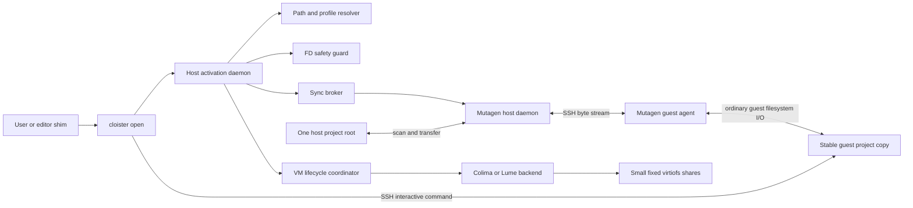
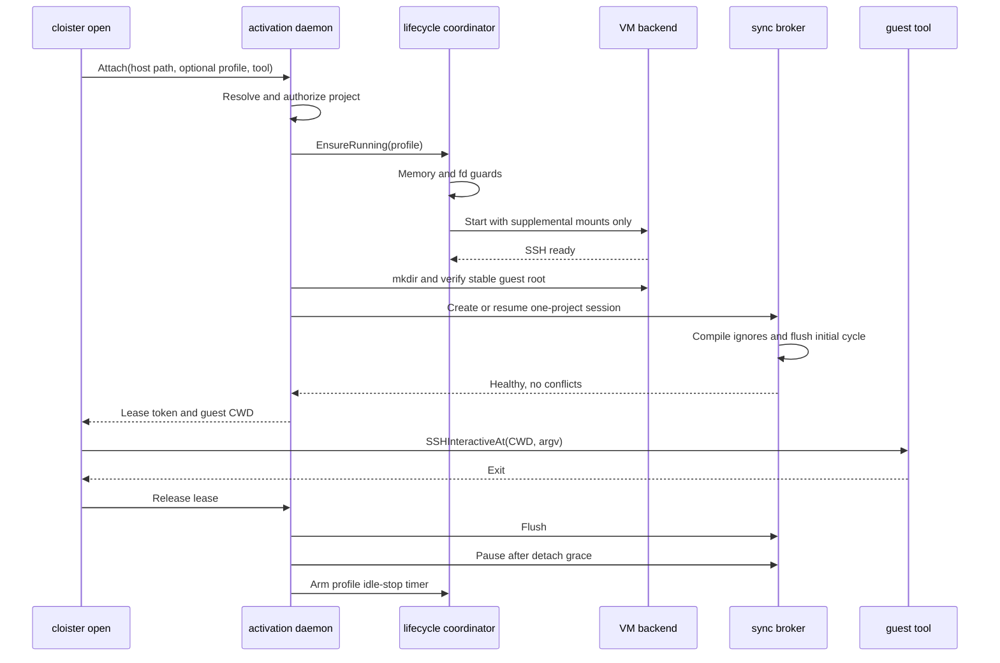

# Tier 2 filesystem broker design

Status: implementation blueprint

Scope: project-scoped, on-demand host to VM filesystem exposure for Colima and Lume profiles. This document does not design the Tier 3 filesystem protocol.

## Executive recommendation

Use Mutagen as an external, version-pinned synchronization engine, controlled by a Cloister host daemon. Create one `two-way-safe` synchronization session per active project and profile pair. The host project is endpoint alpha. A persistent directory on the guest disk is endpoint beta. Normal detach pauses the Mutagen session after a successful flush, preserving both its three-way history and the guest's VM-local dependencies. Normal detach does not delete either copy.

Remove the workspace from `vm.BuildMounts` completely. Keep only the small, fixed supplemental shares such as SSH, GPG, Downloads, Claude extensions, agent skills, and the Ollama model store. Keep `mount_inotify` false for those shares. Build outputs, `.git`, dependency directories, and caches are mandatory sync exclusions and remain independent on each side. The guest copy lives at a stable path such as `~/workspaces/<project-slug>-<project-id>` and is owned by the VM user.

Add `cloister open <path>` as the primary activation entrypoint. It resolves the real host path to a project root and profile, checks host file descriptor headroom, starts the VM without a workspace mount, starts or resumes the one-project sync, waits for an initial flush, then launches the requested shell, Claude, Codex, or Cursor session in the corresponding guest path. A lightweight host daemon owns leases, Mutagen sessions, conflict state, idle detach, and idle VM stop.

This architecture addresses all four required properties:

- Project-scoped: each sync root is one discovered project or Git worktree, never `start_dir` as a whole-tree share.
- On-demand: a session is resumed only while a project lease is active, then flushed and paused.
- Non-fd-holding: Mutagen scans and transfers ordinary files, but does not maintain one host file descriptor for every guest inode. Host FSEvents and a small number of transport descriptors replace virtiofsd's inode descriptor table.
- Filtered: mandatory exclusions cannot be negated by profile or repository rules. Host `.git`, `node_modules`, build outputs, and caches never enter the synchronization data plane.

## Goals and non-goals

### Goals

1. Preserve Cloister's VM process and kernel isolation while reducing each active filesystem boundary to a selected project.
2. Make host edits appear promptly as real files on the guest filesystem and propagate guest edits back to the host.
3. Make activation feel like opening a local project, including path discovery, profile selection, VM startup, initial synchronization, session routing, and cleanup.
4. Prevent another system-wide file descriptor exhaustion event, even when several profiles and many large worktrees exist on the host.
5. Fail safely on conflicts, unsupported filesystem objects, low host descriptor headroom, partial startup, and crashes.
6. Keep the existing supplemental mount consent model and read-only enforcement.

### Non-goals

- This is not a distributed filesystem and does not provide synchronous read-after-write across endpoints. `flush` is the explicit synchronization barrier.
- It does not preserve every macOS filesystem metadata feature. The exact contract is documented below.
- It does not synchronize `.git` or make the host Git database available inside the guest.
- It does not automatically delete persistent guest workspaces or VM-local dependencies.
- It does not replace SSH and GPG forwarding, tunnel policy, memory budgeting, snapshotting, or VM provisioning.

## Repository findings that shape the design

The current implementation has several paths that must change together:

- `internal/vm/mount.go` unconditionally prepends `workspaceDir` as a writable mount, before policy-filtered supplemental mounts. This is the whole-tree exposure that must disappear.
- `internal/config/defaults.go` defaults `start_dir` to `~/code`. Broad values are valid today and therefore cannot be treated as a project boundary.
- `cmd/enter.go`, `cmd/create.go`, `cmd/rebuild.go`, `cmd/reset.go`, `cmd/resize.go`, and `cmd/snapshot.go` independently resolve the workspace and build mounts before starting or restarting a VM. `cmd/setup_openclaw.go` also starts a VM, currently with no mounts. A new centralized VM ensure-up service must replace these duplicated start paths or a future path will reintroduce the old mount.
- `cmd/addstack.go` computes mount changes around `BuildMounts`. Its current length-only comparison is too weak once mount responsibilities are split.
- `internal/vm/backend.go` has a positional `Start` signature. Both backends receive workspace and supplemental mounts as one undifferentiated slice.
- `internal/vm/colima/backend.go` selects virtiofs for every mount. `internal/vm/lume/backend.go` currently consumes only the first mount entry. Removing the prepended workspace changes what that first entry means, so Lume must either support every repeated `--shared-dir` or explicitly reject unsupported supplemental mount combinations.
- The Linux bashrc template converts the host `start_dir` into a virtiofs path, creates `~/workspace` and `~/code` symlinks, and changes directory there. The VM-side config also records a host path and host home. Both must switch to guest paths and stop publishing unnecessary host path details.
- Agent compose and Docker runtime code currently receives the host workspace path, relying on its passthrough mount identity. It must receive the guest workspace path instead. Agent data and generated compose files should move to guest disk or be copied over SSH rather than adding more writable host shares.
- `repair` re-enforces read-only supplemental mounts and should remain responsible for that policy. It must not expect the synchronized project to be a mount point.

## Engine evaluation

| Candidate | Strengths | Blocking weaknesses | Decision |
|---|---|---|---|
| Mutagen over SSH | Purpose-built low-latency two-way development sync, three-way conflict detection, safe mode, filesystem watching, delta transfer, atomic staging, symlink and ownership controls, pause/resume/flush lifecycle, auto-injected remote agent | External pre-1.0 dependency, official release builds include SSPL-licensed code from v0.17, no automatic `.gitignore` file loading, metadata contract is intentionally narrower than POSIX, machine interface must be version-pinned and tested | Primary engine |
| Lima reverse-sshfs | Avoids virtiofsd's fd-per-inode behavior, uses existing SSH transport, guest sees host content immediately | Still a FUSE mount, directly exposes writable host files, poor metadata-heavy performance, no native path filters, builds can write onto the host, mount lifecycle is coupled to the VM configuration, offline guest copy is absent | Diagnostic fallback only, not Tier 2 default |
| Unison | Mature two-way reconciliation, conflict detection, atomic receive-side replacement, no kernel mount, no fd-per-inode behavior | Host and guest versions must be compatible, continuous watching and daemon orchestration are less seamless, ignore translation is still required, operational behavior is less aligned with short-lived project activation | Contingency if Mutagen licensing or support becomes unacceptable |
| Scoped and filtered virtiofs | Lowest latency and native shared-tree behavior, existing backend path | The fd-per-inode mechanism remains, Colima/Lima do not provide sufficient recursive exclusions for this policy, `.git` is inside the project root, activation often requires restart, touching enough included files can still exhaust the host | Reject for Tier 2 |

Mutagen's official documentation describes a three-way merge, `two-way-safe` conflict behavior, atomic staging, portable symbolic links, permission mapping, native or polling watchers, and SSH agent injection. It also states that ignore syntax resembles Git, not that Mutagen reads `.gitignore` files. Cloister must own the difference.

### Dependency and installation model

Phase 1 treats `mutagen` as an external executable and does not add a Go module dependency:

1. `cloister doctor` checks for a specifically supported Mutagen release and OpenSSH.
2. Interactive setup offers the documented Homebrew installation command. Non-interactive use fails with an actionable message. Cloister must never silently run a package manager.
3. A later packaging step may download a pinned binary into `~/.cloister/bin/mutagen/<version>/`, but only with a release manifest, SHA-256 verification, provenance review, and an explicit license decision. Official Mutagen binaries from v0.17 include SSPL code, so this is a distribution decision, not merely a technical detail.
4. The host Mutagen daemon runs as the logged-in host user. It creates host files as that user.
5. Mutagen uses `ssh` and `scp` to inject its matching small agent binary into the VM and runs it as the VM login user. No apt, Homebrew, or persistent root installation is needed in either Linux or macOS guests.
6. The supported version is pinned in `internal/syncbroker/mutagen/version.go`. The CLI adapter uses templated JSON output from the public session model and golden tests from that exact version. Cloister does not parse human-oriented status text.

Risks to track are Mutagen's pre-1.0 compatibility window, release cadence, SSPL content in official binaries, daemon API changes, and availability of matching Darwin and Linux arm64 agents. The fallback criterion is explicit: if a tested Mutagen release cannot be distributed or installed, implement the same `syncbroker.Broker` interface with Unison. Do not fall back to broad virtiofs.

## High-level architecture



The synchronization data path does not pass through a host filesystem mount. The guest works on its own virtual disk. Mutagen observes and copies changes over SSH. Supplemental host resources remain separate and governed by `mount_policy`.

## Core identifiers and paths

The resolver produces a `workspace.Project`:

```go
type Project struct {
    ID           string
    DisplayName  string
    HostRoot     string
    RequestedRel string
    Profile      string
    GuestRoot    string
    GuestCWD     string
}
```

Rules:

- `HostRoot` is a fully canonical real path. For a Git worktree, use `git -C <path> rev-parse --show-toplevel`. A `.git` file that points at worktree metadata is never followed into the sync set. For a non-Git tree, use the nearest `cloister.project.yaml` marker or the explicitly supplied directory.
- Resolve a missing leaf by finding and canonicalizing its nearest existing ancestor, then append validated path components. Reject traversal outside the selected root.
- `ID` is a versioned hash of the canonical host root plus its volume identity. It is stable across Cloister restarts and distinct for separate Git worktrees. The raw host path is stored only in the private state file, never in a Mutagen session name, guest path, environment variable, log label, or shared repository artifact.
- `GuestRoot` is `~/workspaces/<sanitized-base>-<id-prefix>`. It is stable for a project and profile pair. `GuestCWD` appends `RequestedRel` after containment validation.
- Mutagen session names are `cloister-<profile-id>-<project-id>`. Labels include only stable opaque IDs and a schema version.

## Configuration schema

Add a nested profile field and a small global broker section. Keep filesystem durations as strings so YAML remains readable and parsing can return useful errors.

```yaml
version: 3

fs_broker:
  engine: mutagen
  warn_fd_ratio: 0.70
  refuse_fd_ratio: 0.85
  min_fd_headroom: 50000
  idle_scan_interval: 30s

profiles:
  work:
    backend: colima
    start_dir: ~/code
    workspace:
      mode: sync
      roots:
        - ~/code
      respect_gitignore: true
      ignore:
        - .local-generated/
      symlinks: portable
      max_entries: 250000
      max_file_size: 2GiB
      detach_grace: 30s
      idle_stop: 15m

project_routes:
  - path: ~/code/example-service
    profile: work
```

Proposed Go types:

```go
type Config struct {
    // existing fields
    FSBroker      FSBrokerConfig `yaml:"fs_broker,omitempty"`
    ProjectRoutes []ProjectRoute `yaml:"project_routes,omitempty"`
}

type Profile struct {
    // existing fields
    Workspace WorkspaceConfig `yaml:"workspace,omitempty"`
}

type WorkspaceConfig struct {
    Mode             string   `yaml:"mode,omitempty"` // sync or disabled
    Roots            []string `yaml:"roots,omitempty"`
    RespectGitignore *bool    `yaml:"respect_gitignore,omitempty"`
    Ignore           []string `yaml:"ignore,omitempty"`
    Symlinks         string   `yaml:"symlinks,omitempty"` // portable or posix-raw
    MaxEntries       uint64   `yaml:"max_entries,omitempty"`
    MaxFileSize      string   `yaml:"max_file_size,omitempty"`
    DetachGrace      string   `yaml:"detach_grace,omitempty"`
    IdleStop         string   `yaml:"idle_stop,omitempty"`
}
```

Defaults and validation:

- Existing profiles migrate in memory to `workspace.mode: sync`, `roots: [start_dir]`, Git ignore processing enabled, portable symlinks, 250,000 entries, 2 GiB per file, 30 second detach grace, and 15 minute idle stop for interactive profiles.
- `start_dir` becomes a backward-compatible routing root and default host selection hint. It is no longer a mount request and no longer a guest path.
- Headless profiles default `idle_stop` to disabled while an agent process is configured to auto-start. A headless project session can still have an explicit idle policy.
- `roots` are authorization boundaries, not sync roots. Each selected project must be contained by one canonical root.
- `mode: disabled` allows infrastructure-only profiles. Do not expose a broad `virtiofs` mode in the public schema. A temporary migration escape hatch, if absolutely necessary, must be hidden, require an exact project root, reject broad parents, display a high-risk warning, and have a removal release.
- `project_routes` wins over root inference. It is necessary because existing multi-account profiles may intentionally share the same `start_dir`. If multiple profiles match and no route or `--profile` is supplied, interactive use asks and optionally saves a route. Non-interactive use fails as ambiguous.
- User ignore patterns may add exclusions but may not negate mandatory exclusions.
- `posix-raw` symlinks require an explicit warning. Portable mode is the default and required for headless profiles.

Schema version 3 should be written only when configuration is next saved through an authorized configuration command. Loading an old file must not rewrite it as a side effect.

## Mandatory filtering and `.gitignore` compilation

### Mandatory exclusions

The broker appends these rules after all repository and profile rules so negation cannot re-include them:

- VCS metadata: `.git/`, `.hg/`, `.svn/`, including `.git` files used by worktrees.
- JavaScript dependencies and caches: `node_modules/`, `.pnpm-store/`, `.yarn/cache/`, `.bun/`.
- Common outputs: `build/`, `dist/`, `out/`, `target/`, `.next/`, `.nuxt/`, `coverage/`.
- Common caches: `.cache/`, `.turbo/`, `.parcel-cache/`, `.vite/`, `__pycache__/`, `.pytest_cache/`, `.mypy_cache/`.
- Environment-local directories: `.venv/`, `venv/`, editor swap files, Unix sockets, device nodes, and FIFOs.

These paths may exist independently on host and guest. Mutagen ignored content is neither scanned, propagated, nor deleted. A guest `node_modules` therefore survives pause, resume, and host changes. Container builds should use named volumes for the same reason.

Some repositories intentionally use a source directory named `build` or `target`. The hard requirement says build directories must not cross, so the initial implementation treats these leaf directory names as excluded everywhere. `cloister sync explain-ignore <path>` must show the exact mandatory rule. If real repositories prove this too broad, the policy needs a reviewed classification mechanism, not an unvalidated `!` override.

### Git ignore compiler

Mutagen supports Git-like ignore patterns but does not load `.gitignore` files. Add `internal/workspace/ignore` to compile them:

1. Read `.gitignore` files contained within the selected project root. Do not read `.git/info/exclude`, `core.excludesFile`, or a user's global Git ignore file because `.git` is outside the data plane and host-global policy should not silently change a project's VM contents.
2. Parse using a tested Git-compatible parser. Preserve order, negation, directory-only markers, escaped leading `!` and `#`, and anchored versus unanchored semantics.
3. Rebase each nested file's patterns to project-root-relative Mutagen patterns. A pattern from `services/api/.gitignore` must not affect `services/web`.
4. Compare the compiler against `git check-ignore -v` over a conformance corpus. If a rule cannot be represented exactly, fail activation with the source file and line number. Do not broaden exposure on parse failure.
5. Hash the compiled policy into workspace state. The daemon watches `.gitignore` files. On a change it pauses the session, recompiles, snapshots paths that changed classification, recreates the Mutagen session with the new policy, and flushes before resuming the lease.
6. When content becomes newly ignored, Mutagen deliberately leaves it on both sides. Cloister may remove the newly ignored guest copy only after the session is paused, only after verifying containment, and only if it has an identical synchronized hash or has been backed up to the private conflict area. It must never delete the host copy automatically.
7. Mandatory exclusions are stored separately and appended last. Repository negations cannot cancel them.

Policy recreation is relatively rare. Preserving a deterministic policy hash avoids needless session churn.

## Backend and mount interface changes

Replace the positional `Backend.Start` signature with a value object:

```go
type StartSpec struct {
    CPUs               int
    MemoryGB           int
    DiskGB             int
    RootDiskGB         int
    MountInotify       bool
    SupplementalMounts []Mount
    Verbose            bool
}

type Backend interface {
    Start(profile string, spec StartSpec) error
    // existing lifecycle and SSH methods
    SSHInteractiveAt(profile, guestDir string, argv []string) error
}
```

The key naming is deliberate: `SupplementalMounts` cannot be mistaken for a workspace transport. `SSHInteractiveAt` prevents shell injection and avoids the current pattern of joining command arguments into a shell string. Backend implementations may still use a carefully quoted `bash -lc`, but quoting is centralized and tested.

Retain `SSHConfig(profile) SSHAccess` as the transport description. Add validation methods only if needed, not a Mutagen-specific backend method. `syncbroker/mutagen` creates private `ssh` and `scp` wrappers under `~/.cloister/run/ssh/<profile-id>/` that apply the backend's config file or direct host, user, port, and key. It points `MUTAGEN_SSH_PATH` at that directory before the Mutagen daemon starts. This allows both Colima's Lima alias and Lume's direct SSH identity to use the same broker.

Refactor mounts:

```go
func BuildSupplementalMounts(
    homeDir string,
    stacks []string,
    mountPolicy config.ResourcePolicy,
    isHeadless bool,
) []Mount
```

There is no workspace parameter and no unconditional first element. Replace `MountsChanged` with full canonical comparison of location, mount point, and writability. For Lume, probe and test repeated `--shared-dir`. If the installed Lume release cannot accept all allowed supplemental mounts, fail with the unsupported names. Never silently take only the first item.

All VM starts go through `internal/lifecycle.Coordinator.EnsureRunning`. The coordinator performs defaults, disk drift checks where appropriate, memory budgeting, fd checks, supplemental mount construction, backend start with stale-lock recovery, SSH readiness, and post-start read-only enforcement. Commands no longer call `Backend.Start` directly.

## New packages and files

| Path | Responsibility |
|---|---|
| `internal/workspace/project.go` | Project identifiers, stable guest paths, containment-safe relative path mapping |
| `internal/workspace/resolve.go` | Realpath handling, Git worktree root discovery, marker discovery, path to profile routing, ambiguity errors |
| `internal/workspace/ignore/compiler.go` | Nested `.gitignore` parsing and root-relative pattern compilation |
| `internal/workspace/ignore/mandatory.go` | Non-negatable VCS, dependency, output, cache, and special-file exclusions |
| `internal/workspace/ignore/explain.go` | Explain which rule excluded a path |
| `internal/syncbroker/broker.go` | Engine-neutral `Attach`, `Flush`, `Pause`, `Status`, `Conflicts`, `Terminate` interface |
| `internal/syncbroker/types.go` | Attachment spec, status, conflict, and typed error definitions |
| `internal/syncbroker/mutagen/client.go` | Pinned executable discovery, environment, command execution, timeouts, templated JSON decoding |
| `internal/syncbroker/mutagen/session.go` | Deterministic create, resume, flush, pause, terminate, reconnect, and policy-hash logic |
| `internal/syncbroker/mutagen/ssh.go` | Private SSH wrapper generation from `vm.SSHAccess` |
| `internal/syncbroker/mutagen/version.go` | Supported version range and capability checks |
| `internal/activation/manager.go` | Attach state machine, lease reference counts, rollback, release, idle timers |
| `internal/activation/state.go` | Atomically persisted project, session, policy hash, lease, and last-activity state |
| `internal/activation/protocol.go` | Versioned Unix socket request and response messages |
| `internal/activation/daemon.go` | Host daemon, launchd lifecycle, startup reconciliation, periodic idle sweep |
| `internal/fdsafety/darwin.go` | `kern.num_files` and `kern.maxfiles` sampling, thresholds, supplemental tree risk estimate |
| `internal/fdsafety/other.go` | Explicit unsupported or no-op implementation for non-macOS test builds |
| `internal/lifecycle/coordinator.go` | Only supported route for VM start, stop, and ensure-up orchestration |
| `cmd/open.go` | `cloister open`, tool selection, explicit profile, command argument pass-through |
| `cmd/sync.go` | `sync status`, `conflicts`, `flush`, `pause`, `resolve`, `explain-ignore`, and `prune` |
| `cmd/daemon.go` | Hidden host daemon entrypoint and installation/status hooks |
| `cmd/doctor_fs.go` | Mutagen, SSH, guest disk, fd headroom, and backend capability checks |
| `internal/provision/linux/templates/cloister-session.sh` | Optional guest-side session heartbeat helper, deployed as a proprietary Cloister asset if needed |

Any newly added source file should use the repository's normal package comment style. If a file requires an explicit license declaration, use `proprietary`.

## Existing files to modify

| Path | Required change |
|---|---|
| `internal/config/config.go` | Add broker, workspace, and route schemas, version 3 validation, no-write load migration |
| `internal/config/defaults.go` | Separate host routing defaults from guest workspace path defaults |
| `internal/config/policy.go` | Remove the primary workspace from mount policy descriptions, preserve supplemental consent behavior |
| `internal/vm/mount.go` | Replace `BuildMounts` with `BuildSupplementalMounts`, remove workspace mount, deep compare mount sets |
| `internal/vm/backend.go` | Add `StartSpec`, `SSHInteractiveAt`, and matching mock observations |
| `internal/vm/colima/backend.go` | Consume `StartSpec`, pass only supplemental mounts, keep `--mount-inotify=false` by default |
| `internal/vm/lume/backend.go` | Consume `StartSpec`, handle every supported supplemental share or return a capability error |
| `cmd/enter.go` | Route interactive project entry through activation leases, retain tunnel and terminal setup |
| `cmd/create.go` | Validate routing roots, start through the coordinator, provision without workspace mounts, use guest workspace paths for agents |
| `cmd/addstack.go` | Recompute supplemental mounts with deep comparison, restart through coordinator only when required |
| `cmd/rebuild.go` | Quiesce sync first, rebuild through coordinator, restore or recreate paused session state after provisioning |
| `cmd/reset.go` | Flush and pause before snapshot reset, restart without workspace mount, keep guest workspace recovery semantics explicit |
| `cmd/resize.go` | Start through coordinator without workspace mount, preserve pre-resize running state |
| `cmd/snapshot.go` | Flush and pause Lume project sessions before snapshot, restart through coordinator |
| `cmd/repair.go` | Enforce read-only supplemental mounts only, run broker and guest-directory health checks |
| `cmd/setup_openclaw.go` | Use coordinator and make headless workspace attachment explicit rather than starting with a special nil mount path |
| `cmd/stop.go` | Ask activation manager to flush and pause all profile sessions before stopping, refuse unsafe stop unless forced |
| `cmd/status.go` | Display active project count, sync health, conflicts, fd pressure, and idle-stop deadline |
| `cmd/exec.go` | Add optional `--path` activation mode, retain current already-running lightweight behavior when no path is requested |
| `cmd/start_recovery.go` | Move stale-lock retry under the lifecycle coordinator so every start gets identical guards |
| `internal/provision/linux/templates/bashrc.tmpl` | Remove host workspace path derivation, use the active guest workspace supplied at session launch |
| `internal/provision/linux/engine.go` | Deploy guest workspace base, not a host path, in VM config |
| `internal/vmconfig/vmconfig.go` | Replace `HostHome` and mounted host workspace semantics with `WorkspaceBase` and optional active project ID |
| `internal/vmcli/status.go` | Report guest workspace path and sync state without displaying a host path |
| `internal/agent/docker/compose.go` | Bind the guest workspace path or a named volume, never a host passthrough path |
| `internal/agent/docker/runtime.go` | Accept a guest workspace path and copy generated compose data into the guest |
| `internal/agent/native/runtime.go` | Start the native agent only after its required project attachment is healthy |
| `README.md`, `SECURITY.md`, `docs/design/spec.md`, `docs/design/agent-mode.md` | Update the public model from shared `~/code` mount to selected-project sync after implementation lands |

## Activation and routing design

### User-facing entrypoints

Primary command:

```text
cloister open [--profile <name>] [--tool shell|claude|codex|cursor] <path> [-- <tool-args...>]
```

Examples:

```text
cloister open .
cloister open --tool claude ./service
cloister open --profile work --tool codex /path/to/project -- --full-auto
cloister open --tool cursor /path/to/project
```

Behavior:

- Default tool is `shell` for a terminal invocation. A configured opt-in shell shim can map `claude`, `codex`, or `cursor` to `cloister open --tool <name> "$PWD" -- ...`.
- Do not replace global tool binaries automatically. `cloister setup shims` prints the exact changes and requires consent.
- CLI tools run with `Backend.SSHInteractiveAt` and remain children of the `cloister open` process. Process lifetime is the primary lease lifetime.
- Cursor uses its Remote SSH mode against a Cloister-managed host alias and must use a wait-until-window-close option. If a Cursor release cannot provide a reliable wait or heartbeat, the adapter keeps an idle lease rather than detaching immediately and reports that degraded mode.
- Existing `cloister <profile>` remains as a compatibility entrypoint. If `start_dir` resolves to one project, it opens that project. If it is a broad parent, it prompts for a recent project or directs non-interactive callers to `cloister open <path> --profile <profile>`.

### Path to profile resolution

Resolution order is deterministic:

1. Canonicalize the requested path and discover the project root.
2. If `--profile` is present, verify that the project is contained by one of that profile's authorized roots.
3. Otherwise check exact canonical `project_routes`.
4. Otherwise find profiles whose canonical `workspace.roots` contain the project. Choose the single longest-prefix match.
5. If equally specific profiles remain, prompt interactively and offer to save an exact route. Fail non-interactively with the candidate names.
6. Never select a profile by basename, current VM state, or first map iteration.

This handles arbitrary subpaths, symlinked parent directories, monorepos, and Git worktrees while keeping the exposed root explicit.

### Attach state machine



Every transition records intent and completion in private atomic state. On failure, rollback runs in reverse order. It never deletes project data. A failed initial sync pauses the session and reports its retained guest path.

### Leases and daemon protocol

The daemon listens on `~/.cloister/run/fs-broker.sock`, with directory mode `0700` and socket mode `0600`. Launchd socket activation is preferred so the daemon itself need not stay resident. Requests are versioned and accepted only from the same UID.

A lease records profile ID, project ID, owning PID plus process start time, tool kind, created time, last heartbeat, and whether it is interactive. Multiple windows for the same project increment a reference count and reuse one Mutagen session. PID start time prevents reuse from reviving a dead lease.

The daemon uses `kqueue` process exit notification where available and a periodic liveness sweep as fallback. Cursor may also run a guest heartbeat companion over its existing SSH control connection. The guest never receives access to the host daemon socket and cannot request a different host root.

## Synchronization lifecycle

### Initial attach

1. Require an existing host root and record its canonical path, device, and inode.
2. Create the guest root with mode `0700` as the VM login user. The root must be a real directory on the guest disk, not a symlink or mount point.
3. If no prior workspace state exists, require the guest root to be empty except for a Cloister marker. Create Mutagen in `two-way-safe` mode with host alpha and guest beta, then flush. Initial alpha content populates beta.
4. If prior state exists, verify project ID, guest marker, session labels, endpoint paths, and policy hash before resuming. Mismatches pause and require recovery, never automatic adoption.
5. Do not launch the tool until flush succeeds, the session reports at least one successful cycle, both endpoints are connected, and there are no conflicts or endpoint problems.

### Live propagation

- Use portable native watching on both endpoints and accelerated scans. Host changes use FSEvents. Guest changes use native Linux inotify or macOS events on its own virtual disk.
- Keep Colima `mount_inotify` false. Guest dev servers watch an ordinary guest filesystem, not a host mount, so they receive native events from Mutagen's applied creates, writes, removals, and renames.
- Use endpoint-neighboring staging when supported and safe, then atomically move completed files into place. Set a finite staging file limit and entry count to bound disk and scan costs.
- `cloister sync flush` is the user-visible barrier before tests, teardown, snapshots, rebuilds, and stops.

### Detach and stop

On last lease release:

1. Wait the short detach grace to absorb immediate reopen or tool subprocess handoff.
2. Flush guest changes to the host.
3. Query machine-readable status. If conflicts or endpoint problems exist, persist and notify them. Pause the session but do not remove either copy.
4. Pause the Mutagen session. Paused session history is retained and host watcher descriptors are released.
5. Start the profile idle timer. If there are no project leases, headless agents, explicit keepalive, snapshot operations, or active protected tunnels at expiry, stop the VM.

`cloister stop` performs the same flush and pause for every active project before stopping tunnels and the backend. If a flush cannot complete or has conflicts, normal stop refuses with recovery instructions. `--force` stops while retaining guest disk and Mutagen history, marks the attachment dirty, and requires reconciliation at next attach.

Normal detach never calls `mutagen sync terminate`. Explicit project removal uses `cloister sync prune`, requires no leases, performs a final flush, displays both roots and conflict status, terminates the Mutagen session, and asks separately before deleting the guest copy.

### Crash recovery

- Mutagen's three-way session history and the guest disk survive a Cloister daemon crash. On restart, reconcile labeled Mutagen sessions with Cloister state, drop leases whose owner processes are gone, and pause orphaned active sessions.
- A VM or SSH failure marks the session disconnected. Do not reset or recreate it automatically. On next attach, resume the existing history after the VM is ready.
- A host reboot leaves paused or disconnected sessions. Launchd startup reconciliation does not start VMs. A later open resumes on demand.
- A missing host root, changed device/inode identity, mismatched guest marker, or changed endpoint path is a hard recovery condition. Never interpret it as mass deletion.
- Root deletion, root emptying, and bulk replacement safety stops from Mutagen are surfaced verbatim and block teardown from being called clean.

## Conflict policy and host authority

Use `two-way-safe`, not `two-way-resolved`. Declaring the host the source of truth means:

- The host root is the canonical durable copy and alpha endpoint.
- New guest edits are expected and may propagate to the host.
- Simultaneous divergent edits are never silently resolved, even in favor of the host.
- Disaster recovery defaults to retaining the host and treating the guest as a recoverable replica.

`two-way-resolved` would make alpha win every conflict and can destroy unsynchronized guest work. That is incompatible with safe interactive editing.

Expose:

```text
cloister sync conflicts [--profile <name>] [<path>]
cloister sync resolve <path> --host
cloister sync resolve <path> --guest
```

Resolution first copies both versions and metadata into `~/.cloister/conflicts/<project-id>/<timestamp>/` with mode `0700`. It then pauses the session, verifies the path is still conflicting and contained, applies the explicit winner via a sibling temporary file and atomic rename, resumes, and flushes. Directory conflicts require path-by-path review. No default winner is chosen by the daemon.

## Full filesystem correctness contract

| Surface | Required behavior and judgment |
|---|---|
| Editor atomic save | Editors commonly write a sibling temp file, fsync, then rename over the destination. Mutagen scans the resulting state, stages transferred content, and atomically relocates it on the receiving endpoint. The other side may not observe every temporary filename, but after `flush` it must observe the complete new file, never a partial file. Test Cursor, VS Code style rename, Vim swap, JetBrains safe write, and direct truncate-write patterns. |
| Rename and move | A rename can be represented internally as delete plus create, so inode identity is not promised. Content and final path are promised after flush. Case-only renames on a case-insensitive host require a two-step temporary rename or must fail with an actionable collision error. |
| Symlinks | Default `portable` mode transfers only safe relative links that do not escape the root. Absolute links and relative links that traverse outside the root halt sync. `posix-raw` is opt-in for interactive profiles only and preserves raw link text, but can point elsewhere in the guest. Symlink roots are rejected. |
| Hardlinks | Hardlink identity is not preserved by the required contract. Linked regular files become independent files and an atomic replace breaks link identity. Preflight detects `st_nlink > 1` within included content and refuses by default. An explicit `hardlinks: copy` future option may accept de-linking after a warning. Do not claim hardlink correctness without an engine conformance test. |
| File permissions | Mutagen propagates only executable versus non-executable state. Configure alpha-created files as `0644`, directories as `0755`, beta-created files as `0644`, and beta directories as `0755`, subject to umask. Setuid, setgid, sticky, ACL, and arbitrary group-write modes are not synchronized. Repositories depending on them require a provisioning script or are unsupported. |
| Ownership and UID/GID | Host files are created by the host daemon as the host user. Guest files are created by the injected agent as the VM login user, which is `<host-user>.guest` on Colima and the provisioned Lume user on macOS. Configure beta owner and group by the resolved guest name, not copied numeric IDs. Raw ownership is never propagated. |
| Timestamps | Modification times are synchronization hints, not preserved build artifacts. Destination mtime may be the apply time. Content hashing and three-way history determine correctness. Tools that require source timestamp preservation must use a project-specific workaround. Expect conservative rebuilds, not stale builds. Test nanosecond timestamp churn and clock skew. |
| Extended attributes and resource forks | xattrs, Finder tags, quarantine flags, resource forks, and macOS ACLs are outside the Tier 2 contract and must not be assumed to cross. Preflight warns when included regular files have material xattrs or named forks. Security labels are recreated by guest policy, never copied from host. |
| Special files | Sockets, devices, FIFOs, and mount points are rejected or mandatorily ignored. Synchronization roots cannot cross filesystem boundaries. A nested mount inside a project is an activation error unless it is excluded before scanning. |
| File watchers in guest | Mutagen materializes normal guest filesystem operations, so native inotify or FSEvents sees applied changes without `mount_inotify`. Watchers must handle rename-to-destination events. End-to-end tests run an inotify observer and a representative dev server while host atomic saves, deletes, and directory renames occur. |
| Large trees | Initial scan and transfer are proportional to included entries and bytes. Mandatory dependency and output filters keep that set bounded. Display scan and transfer progress, enforce `max_entries` and `max_file_size`, and do not launch the tool before initial flush. Subsequent accelerated scans should be event-driven. |
| Simultaneous edits | Three-way `two-way-safe` reconciliation propagates non-conflicting changes and records conflicting paths without a destructive winner. The session remains recoverable and the CLI reports both sides. |
| Crash during transfer | Receive-side content is staged before atomic placement. A crash may leave private staging data, but must not expose a partially transferred destination file. On reconnect, resume existing session history and flush. Never create a fresh session over two non-empty roots without review. |
| Unicode and case | Mutagen probes filesystem normalization behavior. Preflight creates a temporary probe outside source content and checks case and Unicode collision handling across macOS and the guest. Colliding project names halt activation with the paths listed. |
| Concurrent local processes | Sync is not a locking protocol. Host and guest processes may race. Atomic file replacement prevents torn transferred files, while divergent writes become conflicts. Database files and active package-manager stores belong only on one side and should be ignored. |

### `.git` consequence

The mandatory `.git` exclusion means the guest does not have the host repository database, index, hooks, worktree metadata, or unpushed history. This satisfies the filtering and isolation requirement, and avoids constantly syncing an inode-specific Git index, but it means ordinary guest `git status`, `git diff`, commits, and branch operations are not part of Tier 2.

The first release must show this limitation before launching Claude, Codex, or Cursor and document that version-control operations remain host-side. Do not silently initialize a guest repository, clone from origin, or proxy unrestricted Git commands to the host. A future VCS capability broker could expose a narrowly audited subset with hooks, external diff drivers, filters, credential helpers, and arbitrary config execution disabled, but that is a separate security design.

This is the largest product tradeoff in the stated requirements. If full in-guest Git is later made mandatory, either the `.git` prohibition must change or a separate VCS broker must be approved.

## File descriptor safety analysis

### Why the original failure cannot recur through the workspace path

The current failure scales approximately with every guest inode opened through virtiofs:

```text
host descriptors from workspace share = O(opened guest inodes across broad tree per VM)
```

With this design:

```text
host descriptors from project sync = O(active transfers + watcher infrastructure + SSH sessions)
```

Mutagen opens files while scanning, hashing, or transferring and closes them afterward. The host watcher uses FSEvents rather than retaining an fd for every synchronized inode. The remote watcher and all dev-server inotify descriptors live inside the guest kernel. Pausing the session releases active watcher and transport resources. Project scoping and mandatory filters also bound the number of entries that can be scanned.

There is no host mount for the project, so a guest recursive traversal cannot make virtiofsd pin the project tree. Starting five VMs does not multiply a 176,000-inode host workspace mount five times.

### Remaining virtiofs risk

Small fixed supplemental shares still use virtiofs and therefore still have the same per-inode implementation characteristic. Bound that residual risk:

- Never allow a supplemental mount to equal or contain a configured workspace root.
- Canonicalize and deduplicate supplemental roots.
- Before start, count entries in each supplemental tree with a capped traversal. Warn at 10,000 included entries per VM and refuse at a configurable 25,000 aggregate projected entries unless the user removes that resource from `mount_policy` or explicitly overrides once.
- Multiply the estimate across currently running profiles because the same host extension tree mounted into three VMs can be pinned three times.
- Keep `mount_inotify` false.
- Report supplemental mount entry counts in `cloister doctor`.

### Pre-start host guard

Every VM start, including create, enter, rebuild, reset, resize, snapshot restart, setup, and recovery retry, runs the same Darwin guard:

```text
used = sysctl kern.num_files
limit = sysctl kern.maxfiles
ratio = used / limit
headroom = limit - used
```

Default policy:

- Below 70 percent and at least 100,000 descriptors free: proceed.
- At or above 70 percent, or below 100,000 free: warn with exact values and list running Cloister VMs and active attachments.
- At or above 85 percent, or below 50,000 free: refuse a new VM start.
- An interactive one-time `--allow-low-fd-headroom` override records the observed values and target profile. Non-interactive callers require an explicit flag and never infer consent.
- If sysctl sampling fails on macOS, fail closed for a new VM start. Unit tests on other platforms use an injected sampler.

The daemon samples periodically while VMs run. A rapid unexpected rise marks fd health critical, blocks new attachments, and recommends stopping idle profiles. It never kills an active session without explicit policy, but idle auto-stop is immediate at critical pressure after a clean flush.

### Idle control

- Last project lease release pauses its sync after 30 seconds.
- A profile with no leases, no protected headless process, and no explicit keepalive stops after 15 minutes by default.
- Idle is based on leases and protected work, not only the last shell entry timestamp.
- Status shows the reason a VM is being kept alive and its stop deadline.
- Daemon restart reconstructs liveness and does not leave active syncs silently running.

## Security review

### Preserved boundaries

- The VM remains the process and kernel boundary. Project files are copied into the VM, not executed by a host filesystem server.
- The host daemon authorizes one canonical project root for one profile. The guest Mutagen agent cannot choose or expand alpha's host root.
- Portable symlink mode prevents synchronized links from escaping the selected root. Canonical containment checks occur before every destructive broker action.
- Session labels and guest paths do not reveal absolute host paths. Private state under `~/.cloister` may record them with mode `0600` because the host controller needs recovery information.
- Mandatory filters are applied after user rules and cannot be negated. `.git`, dependencies, outputs, caches, sockets, and nested mounts do not cross.
- SSH and GPG mounts remain read-only in the guest. Read-only prevents modification, not reading or exfiltration, which remains part of the existing interactive profile consent model. GPG private operations continue through the agent-forwarding design.
- Downloads remains read-only. Claude extension directories remain read-write for interactive profiles and are demoted to read-only for headless profiles under existing policy.
- The broker does not widen `mount_policy`. A synchronized project is a separate, explicit capability.

### New attack surface and mitigations

| Risk | Mitigation |
|---|---|
| Compromised guest writes hostile source to host | This is an intentional capability for the selected project only. Use exact root authorization, portable symlinks, ignored special files, conflict-safe reconciliation, and host backups/version control. No other host path is reachable through the sync session. |
| Guest tries to command host broker | Broker Unix socket is host-only. Mutagen agent has only its framed synchronization stream and no socket or host path credentials. |
| Path or shell injection | Keep argv structured, canonicalize paths, avoid session names derived from paths, use `SSHInteractiveAt`, and never concatenate tool arguments into shell commands. |
| Malicious `.gitignore` negates security filters | Mandatory filters are a separate final layer. Unsupported patterns fail activation. The compiler conformance suite compares with Git. |
| Host path replaced after authorization | Record realpath, device, and inode, revalidate before create/resume and destructive actions, reject root symlinks, and stop on identity change. Holding one root descriptor during an operation is acceptable and bounded. |
| Mutagen binary or agent compromise | Pin version and checksum, use official provenance, run host side as the user and guest side as the guest user, do not run either as root, and expose version and binary path in doctor output. |
| SSH config leakage | Generate minimal private wrappers/config, include only the selected backend identity, use strict host key behavior appropriate to ephemeral Cloister VMs, and do not expose the host user's general SSH config to the guest agent. |
| Conflict resolution destroys data | No automatic winner, private backup of both sides, containment recheck, atomic apply, and explicit user direction. |
| Broad supplemental mount recreates pressure | Reject overlap with workspace roots, cap tree cardinality, multiply projected use across running VMs, and retain fd headroom guard. |

Headless agents require additional care. A persistent autonomous agent is a protected lease while running. Its selected project is attached before agent start, and agent stop triggers flush and pause. Agent state, browser cache, dependency data, and compose configuration should live on guest disk or named volumes. Host-mounted agent data is not treated as a harmless supplemental share.

## Operational commands and observability

Add:

```text
cloister open <path>
cloister sync status [<path>|--profile <name>] [--json]
cloister sync flush <path>
cloister sync pause <path>
cloister sync conflicts <path>
cloister sync resolve <path> --host|--guest
cloister sync explain-ignore <path>
cloister sync prune <path>
cloister doctor fs
```

Status should report profile, opaque project ID, host display path only to the local user, guest path, lease count, engine version, connected or paused state, last successful cycle, pending scan or transfer, conflict count, last error, policy hash, last flush, VM idle reason, fd use, and fd limit. JSON output uses stable enums and never requires parsing terminal text.

Logs go to `~/.cloister/logs/fs-broker.log` with rotation and mode `0600`. Do not log file contents, tokens, raw SSH commands containing secrets, or absolute paths at normal verbosity. Debug logging of host paths is opt-in and clearly marked.

Metrics for acceptance and regression:

- Host fd count before attach, after initial sync, after recursive guest traversal, after detach, and after VM stop.
- Included entry and byte count, initial flush latency, steady-state host to guest and guest to host propagation latency.
- Conflict count, reconnect count, failed flush count, policy recompilation count.
- Active leases, paused sessions, idle VMs, and supplemental mount cardinality estimate.

## Migration and rollout

### Compatibility strategy

1. Ship read-only diagnostics first. `cloister doctor fs` identifies broad workspace mounts, estimates entry counts, checks Mutagen availability, and displays projected fd policy without changing VM state.
2. Add config version 3 parsing and the broker behind an opt-in `workspace.mode: sync`. Existing behavior remains available only during a short canary window.
3. Canary a single small project and one Colima profile. Compare file correctness and fd measurements before enabling default sync.
4. Add Lume only after repeated shared-dir behavior, Darwin guest agent injection, ownership, watcher, snapshot, and stop/restart tests pass.
5. Make sync the default for newly created profiles. Existing profiles receive a warning and an explicit `cloister migrate workspace <profile>` command.
6. Migration stops the VM, removes the workspace mount from its next start configuration, starts it with supplemental mounts, creates one selected project guest copy, completes a clean initial flush, and only then marks the profile migrated. Failure leaves host data untouched and reports the retained guest path.
7. After one release with telemetry-free local diagnostics and a rollback command, remove the broad workspace mount path. A rollback may pause sync and export guest changes to a patch directory, but it must not restore a broad virtiofs mount.

Do not auto-create sessions for every child of `start_dir`. Migration asks for the first project and later projects activate on demand.

### Data migration details

- Existing host source remains untouched and authoritative.
- Existing VMs may contain only passthrough paths, not a guest copy. Create the stable guest root on first activation.
- If a prior experimental guest directory is non-empty, quarantine it by renaming within the guest disk and require review. Never merge two non-empty roots with a new history automatically.
- Rebuild and reset must flush projects first. A factory reset can remove guest copies, but the host remains intact and new beta copies are repopulated from alpha. A forced reset with unflushed guest work requires explicit loss acknowledgment.
- Backup should optionally include broker state and conflict metadata, but not duplicate host project content. Guest-only ignored dependencies are disposable and excluded.

## Phased implementation plan and AI-assisted estimates

Estimates are focused implementation time for an AI-assisted engineer with repository access, excluding release waiting time, license review, and long soak periods.

### Phase 0: executable spike and correctness gate, 4 to 6 AI-assisted hours

- Pin a Mutagen candidate version without changing product dependencies.
- Manually sync one fixture project to one Colima guest over its actual SSH config.
- Measure fd count through initial sync, recursive traversal, live edits, pause, resume, and stop.
- Exercise atomic saves, symlinks, executable bits, ignored directories, guest inotify, conflicts, and crash reconnect.
- Confirm templated JSON status and SSH wrapper behavior.
- Exit criterion: no fd growth proportional to traversed project inodes and all required correctness claims have evidence.

### Phase 1: mount separation and lifecycle centralization, 8 to 12 AI-assisted hours

- Introduce `StartSpec`, `BuildSupplementalMounts`, full mount comparison, and lifecycle coordinator.
- Move every direct start and restart callsite to the coordinator.
- Add fd headroom and supplemental cardinality guards.
- Update mocks and unit tests.
- Keep the existing workspace behavior only behind a test-only or temporary canary path until Phase 2 is usable.
- Exit criterion: a static search finds no direct command-layer `Backend.Start` and no production workspace mount construction.

### Phase 2: resolver and Mutagen broker, 12 to 18 AI-assisted hours

- Implement project discovery, route selection, stable IDs, guest roots, mandatory filters, `.gitignore` compilation, Mutagen CLI adapter, private SSH wrappers, attach/resume/flush/pause, status, and recovery state.
- Add `cloister sync` diagnostics and `doctor fs`.
- Exit criterion: single-project non-interactive attach is deterministic and survives VM restart and broker restart.

### Phase 3: seamless activation and daemon lifecycle, 10 to 16 AI-assisted hours

- Implement the Unix socket daemon, launchd activation, leases, process death handling, idle detach, idle VM stop, and `cloister open` for shell, Claude, and Codex.
- Integrate tunnels, terminal identity, last activity, stop, status, and conflict reporting.
- Exit criterion: killing a client, daemon, SSH connection, or VM leaves recoverable state and eventually releases active host sync resources.

### Phase 4: guest path and agent integration, 8 to 12 AI-assisted hours

- Update bashrc, VM config, VM-side status, provisioning, Docker compose, native agents, repair, rebuild, reset, resize, snapshot, and OpenClaw setup.
- Move agent data and compose files off writable host virtiofs shares where feasible.
- Add Cursor Remote SSH adapter after confirming reliable window lifetime tracking.
- Exit criterion: all entry and lifecycle commands use guest paths and no agent receives a host passthrough workspace path.

### Phase 5: migration, end-to-end tests, and documentation, 8 to 14 AI-assisted hours

- Add version 3 migration command, canary switch, rollback export, public documentation, security model changes, and diagnostics.
- Run the real single-project end-to-end suite and a multi-VM fd soak.
- Exit criterion: migration is host-data-preserving, rollback is documented, and broad workspace mounts are disabled by default.

Total focused AI-assisted implementation estimate: 50 to 78 hours, plus a 24 to 72 hour unattended soak and external license review. The estimate is not a human-weeks estimate and should be revised after Phase 0 exposes engine or backend incompatibilities.

## Test strategy

### Unit tests

Configuration:

- Version 2 in-memory defaults, version 3 round trip, no load-time write, duration and size parsing, invalid modes, roots, routes, and thresholds.
- Shared `start_dir` ambiguity, explicit profile authorization, exact route precedence, and longest-root match.

Path safety:

- Existing and missing leaf canonicalization, symlinked parents, symlink escape, `..`, case-only paths, Git worktrees, nested project markers, root replacement, and device/inode changes.
- Stable project ID and guest path with no host path leakage.

Ignore compiler:

- Root and nested `.gitignore`, anchored and unanchored rules, negation, escaped markers, spaces, directory-only rules, ignored parent behavior, worktree `.git` file, mandatory final rules, and unsupported syntax failure.
- Table-driven comparison with `git check-ignore -v` for thousands of generated path and rule cases.

Broker:

- Exact Mutagen argv and environment, version rejection, templated JSON decode, timeout and cancellation, idempotent create/resume/pause, policy mismatch, disconnected endpoint, conflict state, staging limit, and command failure redaction.
- Golden public model JSON for the pinned Mutagen release.

Activation:

- State transition rollback at every step, duplicate leases, stale PID with reused number, daemon restart, last lease release, detach grace, dirty forced stop, protected headless lease, and idle-stop cancellation on reopen.

FD safety:

- Injected sysctl values at every threshold, sampling failure, explicit override, multiplication across running VMs, capped supplemental traversal, overlap rejection, and critical-pressure idle stop.

Backend and commands:

- `StartSpec` propagation for Colima and Lume, no workspace mount flags, all supplemental mount flags, stale-lock retry re-runs guards, safe argv quoting, and every create/restart path using the coordinator.
- A repository test can use `rg` or Go AST inspection to reject command-layer direct calls to `Backend.Start`.

### Real single-project end-to-end test

Gate with an integration build tag and require a disposable profile and temporary host project outside shared source repositories.

1. Record `kern.num_files`, start the VM with no workspace mount, and assert mount output contains only allowed supplemental roots.
2. Create a fixture with at least 20,000 included small files, nested `.gitignore` files, mandatory ignored dependency/output trees, relative symlinks, executable and non-executable files, Unicode names, and known xattrs/hardlinks for warning cases.
3. Attach and wait for initial flush. Assert included content and hashes match, mandatory ignored content is absent, ownership is the VM user, default modes match, executable state matches, and `.git` is absent.
4. Perform host atomic save, truncate-write, file create, delete, directory rename, case-only rename, and symlink update. Assert complete guest results and native inotify events.
5. Perform the same supported operations in the guest and assert host results after flush.
6. Modify the same path differently on both sides while paused, resume, and assert a conflict with neither version destroyed. Resolve each direction in separate runs and verify private backups.
7. Kill Mutagen transport during a large transfer, restart the daemon, stop and start the VM, then assert recovery from existing history without partial destination files.
8. Run a recursive guest read and `find` over all included content. Assert host fd growth remains bounded and does not track 20,000 inodes.
9. Release the lease, assert the session pauses, record descriptor reclamation, wait for idle stop, and assert the VM stops.
10. Repeat with two projects in one VM and two VMs. Assert only leased projects are active and fd use stays below the acceptance budget.

### Acceptance thresholds

- No production VM start includes a workspace root in `--mount` or `--shared-dir`.
- After recursive traversal, incremental host fd growth attributable to an attached project is less than a fixed small budget established in Phase 0, suggested initial gate 256 descriptors per active project, and is not correlated with entry count.
- Mandatory ignored directories and `.git` never appear in a fresh guest copy.
- Initial attach blocks until clean flush. Normal detach and normal stop never report success with pending conflicts or a failed flush.
- Host and guest never observe a partially transferred destination file after an engine or VM crash.
- Guest dev-server watchers observe the supported host edit patterns with `mount_inotify=false`.
- An idle project pauses, and an idle eligible VM stops, without manual intervention.
- `kern.num_files` guard is executed for every start route and refuses at the configured critical threshold.

## Risks, decisions to revisit, and rollout blockers

1. Mutagen licensing and support are release blockers. Technical success in Phase 0 does not authorize distributing its official binary.
2. `.git` exclusion prevents normal Git-aware agent behavior in the guest. Product must accept host-side Git for Tier 2 or commission a separate VCS broker design.
3. `.gitignore` translation must prove semantic equivalence. A partial parser is unsafe because it can silently expose ignored secrets or sync generated trees.
4. Lume's current first-mount-only implementation needs a capability decision. Silent supplemental mount loss is unacceptable.
5. Full metadata fidelity is intentionally not promised. Repositories requiring hardlinks, xattrs, ACLs, resource forks, raw ownership, or preserved mtimes must be detected and rejected or handled by project-specific tooling.
6. The default mandatory `build/` and `target/` rules may collide with source directories. Collect real repository evidence before changing the non-negatable policy.
7. Cursor lifetime tracking varies by release. Shell, Claude, and Codex process-bound activation should ship before Cursor if `--wait` or heartbeat cannot be proven.
8. Supplemental virtiofs mounts remain a smaller residual fd risk. Cardinality limits and the global headroom guard are required, not optional hardening.

## Reference material

- [Mutagen synchronization architecture and modes](https://mutagen.io/documentation/synchronization)
- [Mutagen ignore behavior](https://mutagen.io/documentation/synchronization/ignores)
- [Mutagen VCS guidance](https://mutagen.io/documentation/synchronization/version-control-systems/)
- [Mutagen permissions model](https://mutagen.io/documentation/synchronization/permissions)
- [Mutagen symbolic link modes](https://mutagen.io/documentation/synchronization/symbolic-links/)
- [Mutagen filesystem watching](https://mutagen.io/documentation/synchronization/watching)
- [Mutagen staging behavior](https://mutagen.io/documentation/synchronization/staging/)
- [Mutagen SSH transport and agent injection](https://mutagen.io/documentation/transports/ssh/)
- [Mutagen installation](https://mutagen.io/documentation/introduction/installation)
- [Mutagen license](https://github.com/mutagen-io/mutagen/blob/master/LICENSE)
- [Lima reverse-sshfs mounts](https://lima-vm.io/docs/config/mount/)
- [Unison source and manual](https://github.com/bcpierce00/unison)
